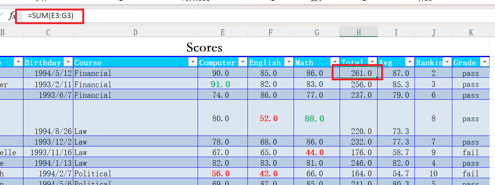
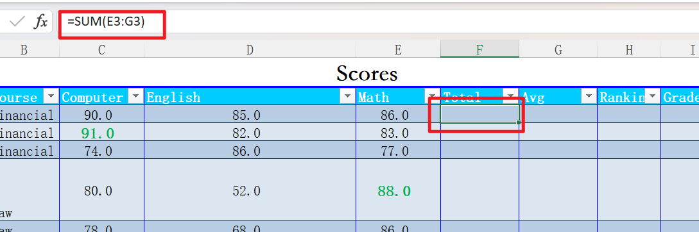

# 说明
openpyxl并未对很多Excel中的自动化操作提供支持。   
比如在插入和删除行列时，Excel中的公式会受影响。  
openpyxl并没有排序之类的方法，而这些方法在Excel中时被支持的。   
本库对这些操作提供支持。   
# 例子
## 删除行之前

## 直接使用openpyxl
不会像Excel一样自动调整公式

## 使用openpyxl_autofill之后
像Excel一样自动调整

# 从pip安装
```
pip install openpyxl_autofill
```
# 使用
```
from openpyxl import load_workbook
import openpyxl_autofill
openpyxl_autofill.enable_all()
wb = load_workbook(...)
ws = wb.active
ws.insert_rows(...)
...
```
# 功能清单
## sort
对给定范围的单元格进行排序
## insert
包含insert_rows和insert_cols，在插入行和列的时候，自动调整原有excel中的公式，合并单元格，表格
## delete
包含delete_rows和delete_cols，在删除行和删除列的时候，自动调整原有excel中的公式，合并单元格，表格
# 下一步计划
增删行和列的时候支持跨sheet的公式 
排序的时候支持对有公式的列进行调整，先对公式进行计算再排序

